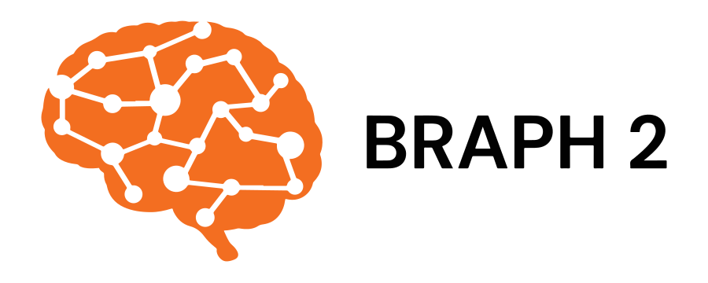

# GapVAE

**GapVAE** is a BRAPH 2 distribution for unsupervised representation learning, clustering, data generation, and missing-data completion using variational autoencoders.

The name **GapVAE** combines two ideas:

- **GapNet**, a deep-learning framework designed to analyse incomplete multimodal biological data, from the following publication:

> Chang et al., *Neural network training with highly incomplete medical datasets*.
> [Machine Learning: Science and Technology 3, 035001](https://iopscience.iop.org/article/10.1088/2632-2153/ac7b69).  

- **Variational Autoencoder (VAE)**, a generative neural-network model that learns a latent representation of data and can generate or reconstruct samples.

GapVAE is designed for applications in **neuroimaging**, **proteomics**, **genomics**, and other biomedical datasets where missingness, multimodal structure, and latent biological variation are central analytical challenges.

The distribution provides example pipelines for:

- unsupervised clustering in latent space
- data generation from learned latent representations
- data reconstruction and completion
- proof-of-concept validation using the MNIST handwritten-digit dataset
- future extension to multimodal biomedical data

GapVAE reuses the core infrastructure of **BRAPH 2**, including its object-oriented data structure, graphical user interface, neural-network elements, and Genesis-based software-generating mechanism.

For a general introduction to BRAPH 2, please refer to the main [BRAPH 2 repository](https://github.com/braph-software/BRAPH-2/tree/develop).

---

## Example figures

> 
> **Latent-space clustering of MNIST digits**
> Each point represents one image, and colours indicate digit labels. Although labels are shown for visualisation, the VAE learns the latent representation in an unsupervised manner. This example validates the basic use of Gap VAE for latent-space exploration and unsupervised clustering.
> 

> 
> **Generated handwritten digits sampled from the learned VAE latent space**
> The smooth transition between digit-like images illustrates that the model has learned a continuous and meaningful latent representation. This provides a proof of concept for data generation and reconstruction, which can later be extended to biomedical data completion.
> 
